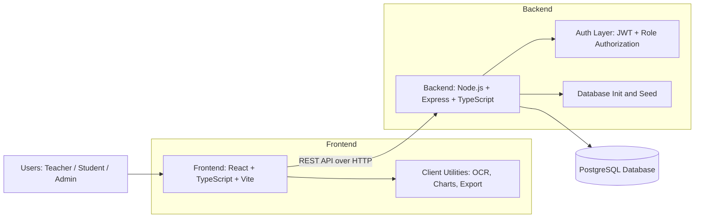
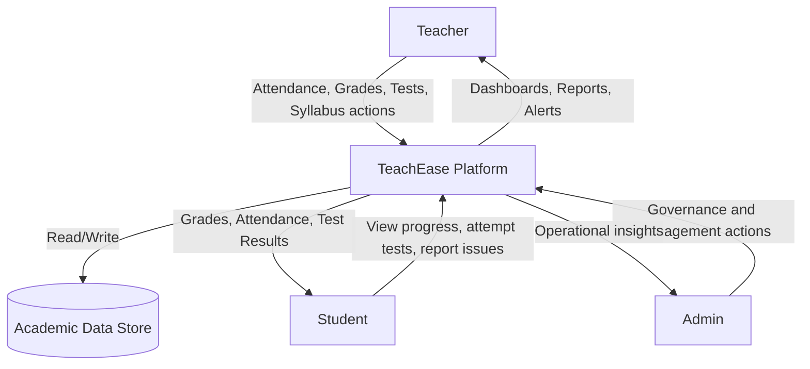
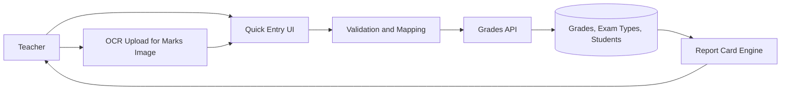
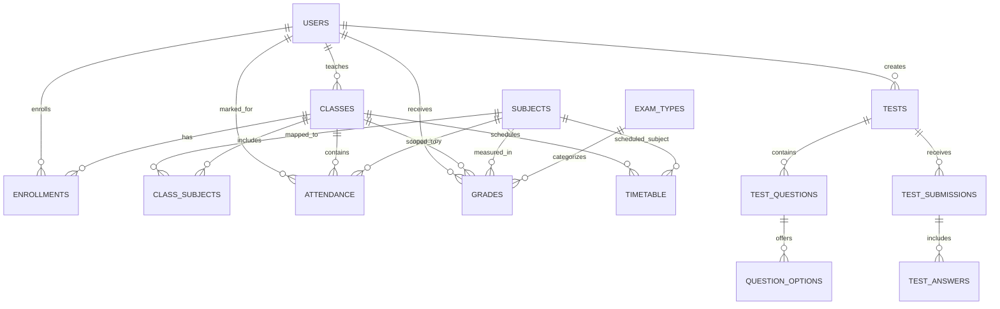
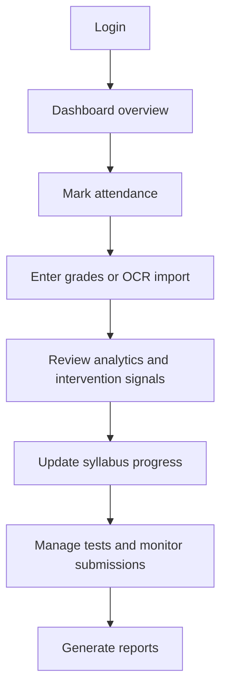
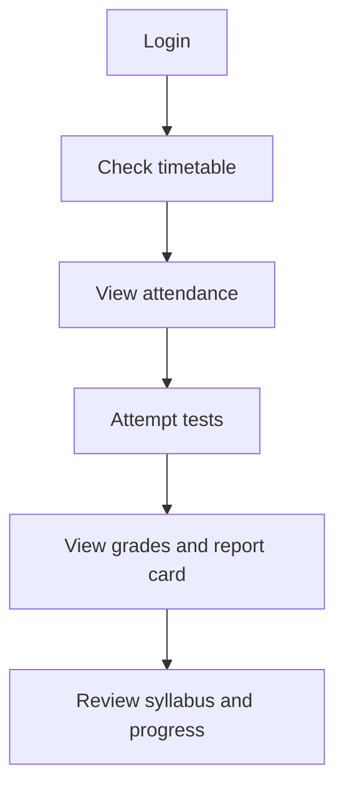

# TeachEase

Teacher-Centric Academic Administration System

TeachEase is a full-stack web platform that helps schools reduce teacher administrative workload by streamlining attendance, grading, class management, timetable tracking, syllabus tracking, tests, analytics, and report workflows.

It is designed to be understandable for both non-technical stakeholders (school leaders, coordinators, teachers) and technical teams (developers, QA, DevOps).

---

## 1. Executive Summary

### What problem does TeachEase solve?

Teachers spend significant time on repetitive admin work:

- Taking attendance manually
- Entering and re-checking marks
- Building class reports
- Tracking students who need intervention
- Managing schedules and syllabus progress

TeachEase centralizes these activities in one workflow-driven platform.

### What value does it deliver?

| Area | Before TeachEase | With TeachEase |
|---|---|---|
| Attendance | Manual records and delayed summaries | Single and bulk attendance with instant stats |
| Grades | Repetitive data entry and correction cycles | Quick entry, OCR-assisted mark extraction, report generation |
| Academic risk tracking | Late identification of weak students | Intervention signals and analytics dashboards |
| Timetable and class flow | Fragmented tracking | Unified teacher view of schedule, class data, and actions |
| Test operations | Manual setup and grading overhead | Test creation, student progress, analytics, and issue reporting |

### Who is this for?

- Teachers: Faster daily workflows and fewer repetitive tasks
- Students: Clear visibility into attendance, grades, and progress
- Admins/School leaders: Better oversight via analytics and structured data
- Developers: Clean TypeScript codebase with clear API boundaries

---

## 2. Product Scope

### Core Modules

| Module | Key Capabilities |
|---|---|
| Authentication | Role-based login, profile read/update, JWT security |
| Students | Create/update students, bulk creation, enrollment management |
| Classes | Class lifecycle, student listing, subject assignment |
| Attendance | Single/bulk mark, lock by class/date, class and student statistics |
| Grades | CRUD on marks, exam types, class/student views, report card generation |
| Analytics | Dashboard stats, class insights, student insights, intervention signals |
| Timetable | Teacher/class schedules, create/update/delete time slots |
| Syllabus | Create syllabus, topic status updates, teacher and student syllabus views |
| Tests | Test authoring, question workflows, submissions, analytics, PDF-based quiz generation |

### Teacher Productivity Enhancers

- Bulk operations where possible
- Better visibility into pending actions
- OCR-assisted grade input in the grading workflow
- Intervention-oriented analytics
- Report and export readiness

---

## 3. System Architecture

### High-Level Architecture Diagram



### Data Flow Diagram (Level 0)



### Data Flow Diagram (Level 1: Grade Entry and Reporting)



---

## 4. Technology Stack

| Layer | Technology | Purpose |
|---|---|---|
| Frontend | React 18 + TypeScript | Component-driven UI with type safety |
| Frontend Build | Vite | Fast development and optimized builds |
| Styling | Tailwind CSS | Utility-first responsive UI styling |
| Routing | React Router | Client-side navigation |
| HTTP Client | Axios | API communication |
| Charts | Recharts | Analytics and visual insights |
| OCR | tesseract.js | Extract marks from image-based inputs |
| Export | xlsx | Spreadsheet export support |
| Backend | Node.js + Express + TypeScript | REST API and business logic |
| Database | PostgreSQL | Relational data store |
| Auth | JWT + bcryptjs | Authentication and credential security |

---

## 5. Repository Structure

```text
project/
|-- backend/
|   |-- src/
|   |   |-- config/
|   |   |   |-- database.ts
|   |   |   |-- initDb.ts
|   |   |   |-- schema.sql
|   |   |   |-- seed.ts
|   |   |-- controllers/
|   |   |-- middleware/
|   |   |-- routes/
|   |   `-- index.ts
|   |-- package.json
|   `-- tsconfig.json
|-- frontend/
|   |-- src/
|   |   |-- components/
|   |   |-- context/
|   |   |-- pages/
|   |   |-- services/
|   |   `-- types/
|   |-- package.json
|   `-- vite.config.ts
|-- package.json
|-- QUICKSTART.md
`-- README.md
```

---

## 6. Setup and Run Guide

### Prerequisites

| Requirement | Recommended Version |
|---|---|
| Node.js | 18+ |
| npm | 9+ |
| PostgreSQL | 14+ |

### Environment Configuration

Create backend/.env:

```env
PORT=5000
NODE_ENV=development

DB_HOST=localhost
DB_PORT=5432
DB_NAME=teachease
DB_USER=postgres
DB_PASSWORD=your_password

JWT_SECRET=your-super-secret-jwt-key-change-this-in-production
JWT_EXPIRES_IN=7d
```

### Install Dependencies

From project root:

```bash
npm run install-all
```

### Run in Development

Terminal 1 (backend):

```bash
cd backend
npm run dev
```

Terminal 2 (frontend):

```bash
cd frontend
npm run dev
```

Default URLs:

- Frontend: http://localhost:3000
- Backend: http://localhost:5000
- Health check: http://localhost:5000/api/health

### Build for Production

From project root:

```bash
npm run build
```

### Root Scripts

| Script | Description |
|---|---|
| npm run install-all | Installs backend and frontend dependencies |
| npm run dev:backend | Starts backend in watch mode |
| npm run dev:frontend | Starts frontend Vite dev server |
| npm run build:backend | Builds backend TypeScript |
| npm run build:frontend | Builds frontend bundle |
| npm run build | Builds backend and frontend |

---

## 7. User Roles and Access Model

| Role | Typical Actions |
|---|---|
| Teacher | Manage classes/students, mark attendance, enter grades, manage tests/syllabus, view analytics |
| Student | View attendance/grades/syllabus, attempt tests, report question issues |
| Admin | Manage and supervise across all modules |

Access is enforced by JWT authentication and role authorization middleware.

---

## 8. API Reference

Base URL: /api

### Authentication

| Method | Endpoint | Description |
|---|---|---|
| POST | /auth/register | Register user |
| POST | /auth/login | Login and receive token |
| GET | /auth/profile | Get profile |
| PUT | /auth/profile | Update profile |

### Students

| Method | Endpoint | Description |
|---|---|---|
| POST | /students | Create student |
| POST | /students/bulk | Bulk create students |
| GET | /students | List students |
| GET | /students/:id | Get student by id |
| PUT | /students/:id | Update student |
| DELETE | /students/:id | Delete student (admin) |
| POST | /students/enroll | Enroll student in class |

### Classes

| Method | Endpoint | Description |
|---|---|---|
| POST | /classes | Create class |
| GET | /classes | List classes |
| GET | /classes/subjects | List subjects |
| GET | /classes/:id | Get class by id |
| PUT | /classes/:id | Update class |
| DELETE | /classes/:id | Delete class (admin) |
| GET | /classes/:id/students | List class students |
| POST | /classes/assign-subject | Assign subject to class |

### Attendance

| Method | Endpoint | Description |
|---|---|---|
| POST | /attendance | Mark attendance |
| POST | /attendance/bulk | Bulk attendance marking |
| POST | /attendance/lock | Lock attendance for class/date |
| GET | /attendance/class | Class attendance view |
| GET | /attendance/lock-status | Check class/date lock |
| GET | /attendance/student/:studentId | Student attendance view |
| GET | /attendance/stats | Attendance statistics |

### Grades

| Method | Endpoint | Description |
|---|---|---|
| POST | /grades | Add grade |
| PUT | /grades/:id | Update grade |
| DELETE | /grades/:id | Delete grade |
| GET | /grades/class | Class grades |
| GET | /grades/student/:studentId | Student grades |
| GET | /grades/report-card | Report card generation |
| GET | /grades/exam-types | List exam types |

### Timetable

| Method | Endpoint | Description |
|---|---|---|
| POST | /timetable | Create timetable entry |
| GET | /timetable/class/:classId | Class timetable |
| GET | /timetable/teacher/:teacherId? | Teacher timetable |
| PUT | /timetable/:id | Update timetable entry |
| DELETE | /timetable/:id | Delete timetable entry |

### Analytics

| Method | Endpoint | Description |
|---|---|---|
| GET | /analytics/dashboard | Dashboard stats |
| GET | /analytics/class/:classId | Class analytics |
| GET | /analytics/class/:classId/intervention-signals | Intervention indicators |
| GET | /analytics/student/:studentId | Student analytics |

### Syllabus

| Method | Endpoint | Description |
|---|---|---|
| POST | /syllabus | Create syllabus |
| GET | /syllabus/teacher | Teacher syllabuses |
| GET | /syllabus/class | Syllabus by class |
| GET | /syllabus/student-view | Student syllabus view |
| PATCH | /syllabus/topics/:topicId/status | Update topic status |
| DELETE | /syllabus/:syllabusId | Delete syllabus |

### Tests

| Method | Endpoint | Description |
|---|---|---|
| POST | /tests | Create test |
| POST | /tests/generate-from-pdf | Generate quiz from PDF |
| POST | /tests/:testId/questions | Add question |
| PUT | /tests/:testId/questions | Replace questions |
| PUT | /tests/:testId/settings | Update settings |
| PUT | /tests/:testId/publish | Publish test |
| GET | /tests/class | List class tests |
| GET | /tests/:testId | Get test detail |
| GET | /tests/:testId/progress | Student test progress |
| POST | /tests/:testId/save | Save student test progress |
| POST | /tests/:testId/submit | Submit answers |
| POST | /tests/:testId/questions/:questionId/report | Report question issue |
| GET | /tests/:testId/question-reports | List question reports |
| PUT | /tests/:testId/question-reports/:reportId | Resolve/report status update |
| GET | /tests/:testId/results | Test results view |
| GET | /tests/:testId/analytics | Test analytics |

---

## 9. Database Model

Schema source: backend/src/config/schema.sql

### Key Tables by Domain

| Domain | Main Tables |
|---|---|
| Identity | users |
| Academic structure | classes, subjects, class_subjects, enrollments |
| Attendance | attendance, attendance_locks |
| Grades | grades, exam_types |
| Timetable | timetable |
| Syllabus | syllabuses, syllabus_topics |
| Assessment | tests, test_questions, question_options, test_submissions, test_answers, test_question_reports |
| Communication | announcements |

### Simplified Entity Relationship Diagram



---

## 10. End-to-End Workflow View

### Teacher Daily Workflow



### Student Academic Workflow



---

## 11. OCR in Grades (Teacher Workload Reduction)

TeachEase includes OCR support in the grading workflow to reduce manual typing when marks are available in image form.

How it works:

1. Teacher uploads a marks image from the grades quick entry flow.
2. OCR extracts numeric text values using tesseract.js.
3. Parsed values are mapped into quick-entry rows.
4. Teacher reviews and submits through normal validation and API save.

Benefits:

- Faster entry for large classes
- Reduced manual typing effort
- Keeps final teacher review in control before save

---

## 12. Security and Reliability Notes

| Area | Current Mechanism |
|---|---|
| Authentication | JWT-based token auth |
| Passwords | Hashed using bcryptjs |
| Authorization | Role-based middleware guard |
| Input transport | JSON API with controlled body size |
| Data integrity | SQL constraints, indexes, unique keys |
| Error handling | Centralized middleware in backend |

Recommended production hardening:

- Use strong JWT secret and key rotation policy
- Add rate limiting and request logging
- Enable HTTPS behind reverse proxy
- Add monitoring and structured logs
- Audit dependency vulnerabilities regularly

---

## 13. Troubleshooting

| Problem | Likely Cause | Resolution |
|---|---|---|
| Frontend not loading | Dev server not running or wrong port | Run frontend dev server and confirm port 3000 |
| API calls failing from frontend | Backend not running or proxy mismatch | Start backend on port 5000 and check frontend Vite proxy |
| Database connection error | Invalid DB credentials or DB not running | Verify backend/.env and PostgreSQL service status |
| Login fails for demo user | Seed not completed | Restart backend and inspect startup logs for seed execution |
| Build errors | Dependencies missing or stale lock state | Reinstall dependencies in root, backend, and frontend |

---

## 14. Quick Non-Technical Walkthrough

If you are a school stakeholder and not a developer, this is the shortest way to understand the platform:

1. Teachers log in and immediately see what matters today.
2. Attendance and grading happen in guided screens that reduce repetitive input.
3. Student performance issues are surfaced by analytics instead of manual spreadsheet work.
4. Reports become a workflow output, not a separate manual task.
5. The same data supports classes, timetable, tests, syllabus, and intervention planning.

This creates less admin burden and more time for actual teaching support.

---

## 15. FAQ

### Is this only for technical teams?

No. The product itself is built for school users. This README includes developer details for implementation teams.

### Can teachers use this without complicated setup?

Yes in deployed environments. Local setup in this document is primarily for developers.

### Is OCR mandatory for grading?

No. OCR is optional and designed as a speed assistant in quick-entry workflows.

### Does the system support student and admin roles?

Yes. The backend enforces role-based access for teacher, student, and admin.

### Is this production-ready out of the box?

The platform is functional and complete for core workflows. For production, apply standard hardening, observability, and security governance.

---

## 16. Contributing

1. Fork the repository.
2. Create a feature branch.
3. Keep changes scoped and documented.
4. Validate build for backend and frontend.
5. Open a pull request with clear change notes.

---

## 17. License

MIT License
